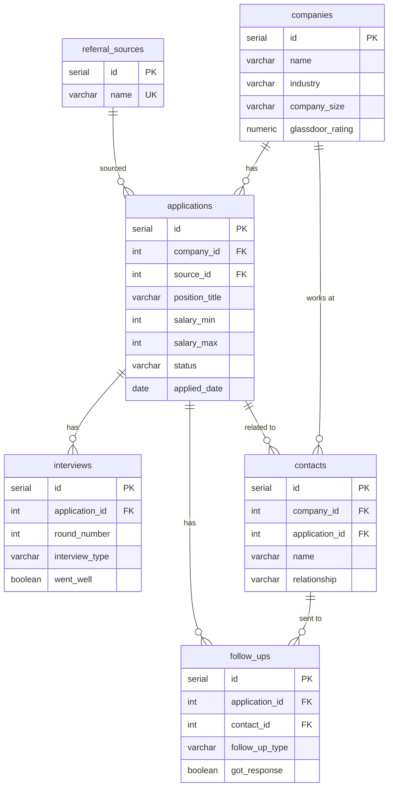

# Job Hunt Tracker

A PostgreSQL database for tracking job applications, interviews, contacts, and outcomes — built to answer the questions that actually matter during a job search.

## Why This Exists

Spreadsheets fall apart after 20+ applications. This database tracks everything from first application to final offer, with queries that surface real insights like which referral sources lead to interviews, how long companies take to respond, and where your pipeline is leaking.

## Schema

Six tables connected by foreign keys:



> Full ERD with all columns available in [`docs/erd.mmd`](docs/erd.mmd)

| Table | Purpose |
|-------|---------|
| `referral_sources` | How you found each listing (LinkedIn, referral, etc.) |
| `companies` | Company info: size, industry, Glassdoor rating |
| `applications` | Core table: position, salary range, status, dates |
| `interviews` | Each round: type, interviewer, outcome |
| `contacts` | People you've talked to at each company |
| `follow_ups` | Thank-you emails, check-ins, negotiations |

## Sample Queries

The `queries/` folder includes 12 analytical queries. Highlights:

**Pipeline overview** — Where do all my applications stand?
```sql
SELECT status, COUNT(*) AS total,
       ROUND(COUNT(*) * 100.0 / SUM(COUNT(*)) OVER (), 1) AS pct
FROM applications
GROUP BY status ORDER BY total DESC;
```

**Referral source effectiveness** — Which sources actually lead to interviews?
```sql
SELECT rs.name AS source, COUNT(DISTINCT a.id) AS applications,
       COUNT(DISTINCT CASE WHEN i.id IS NOT NULL THEN a.id END) AS got_interviews
FROM referral_sources rs
JOIN applications a ON a.source_id = rs.id
LEFT JOIN interviews i ON i.application_id = a.id
GROUP BY rs.name ORDER BY got_interviews DESC;
```

**Interview funnel** — How many apps make it to each stage?
```sql
WITH stages AS (
    SELECT a.id, a.status, COALESCE(MAX(i.round_number), 0) AS max_round
    FROM applications a
    LEFT JOIN interviews i ON i.application_id = a.id
    GROUP BY a.id, a.status
)
SELECT COUNT(*) AS total_applications,
       SUM(CASE WHEN max_round >= 1 THEN 1 ELSE 0 END) AS reached_phone_screen,
       SUM(CASE WHEN max_round >= 2 THEN 1 ELSE 0 END) AS reached_round_2,
       SUM(CASE WHEN status = 'offer' THEN 1 ELSE 0 END) AS got_offer
FROM stages;
```

## SQL Concepts Demonstrated

- Common Table Expressions (CTEs)
- Window functions (`SUM() OVER`, running totals)
- Conditional aggregation (`CASE` inside `COUNT`/`SUM`)
- Date arithmetic and `DATE_TRUNC`
- `STRING_AGG` for grouped concatenation
- `HAVING` for post-aggregation filtering
- Multiple `JOIN` types (INNER, LEFT)
- Check constraints and indexing strategy
- Normalized schema design with foreign keys
- Reusable views for common access patterns

## Views

Five views in `schema/002_create_views.sql` that wrap the most common joins:

| View | What it does |
|------|-------------|
| `v_application_details` | Full application info with company, source, and calculated fields (days to response, salary range) |
| `v_interview_history` | Interview rounds with company and position context |
| `v_contacts` | Contact directory with company and application status |
| `v_follow_up_log` | Follow-up timeline with contact and company info |
| `v_pipeline_summary` | One-row-per-status breakdown with counts and avg salary |

After creating the views, you can query them like regular tables:

```sql
SELECT * FROM v_application_details WHERE status = 'offer';
SELECT * FROM v_pipeline_summary;
```

## Setup

Requires [PostgreSQL](https://www.postgresql.org/download/) 15+.

```bash
# create the database
psql -U postgres -c "CREATE DATABASE job_hunt_tracker;"

# build the schema
psql -U postgres -d job_hunt_tracker -f schema/001_create_tables.sql

# create views
psql -U postgres -d job_hunt_tracker -f schema/002_create_views.sql

# load sample data
psql -U postgres -d job_hunt_tracker -f data/seed.sql

# run the analytical queries
psql -U postgres -d job_hunt_tracker -f queries/analysis.sql
```

## Project Structure

```
job-hunt-tracker/
├── schema/
│   ├── 001_create_tables.sql    -- table definitions and indexes
│   └── 002_create_views.sql     -- reusable views for common joins
├── data/
│   └── seed.sql                 -- realistic sample data (15 apps, 10 companies)
├── queries/
│   └── analysis.sql             -- 12 analytical queries
├── docs/
│   └── erd.mmd                  -- full entity-relationship diagram (Mermaid)
└── README.md
```

## What I'd Add Next

- Stored procedures for status transitions with validation
- A `salary_offers` table for tracking negotiation history
- Indexes tuned to query patterns after profiling with `EXPLAIN ANALYZE`
- Trigger functions to auto-update `closed_date` when status changes to a terminal state
